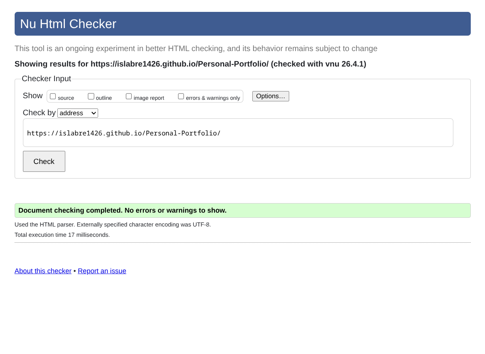

# Personal Portfolio
This is a Personal Portfolio, intended for Web Application Development Lab at International University, VNU-HCMC.

Currently working in progress.

## Sitemap
```
/
├── /about.html
├── /blog.html
├── /contact.html
├── /form.html
├── /hello-world.html
├── /index.html
├── /more.html
└── /projects.html
```

## Features
- Minimally styled
- Semantic HTML
- Cute pics!

## W3C Validator Result


## Credits
- [Bradley Taunt's website](https://btxx.org/): For sitemap footer inspiration
- [Karl Bartel's website](https://www.karl.berlin/): For navigation inspiration
- [Unsplash](https://unsplash.com/): For various images
- [Font Awesome](https://fontawesome.com/): For favicon